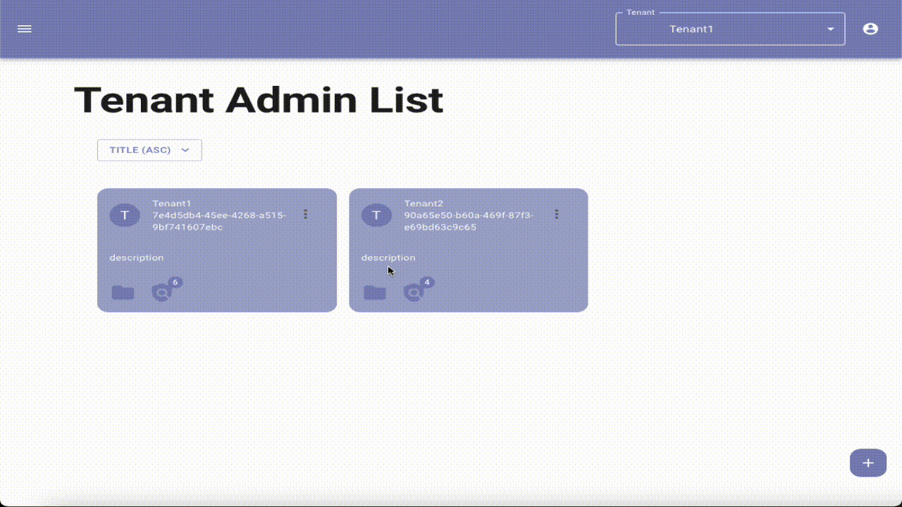

# Auth Management UI

[](https://www.fiware.org/developers/catalogue/)
[](https://opensource.org/licenses/APACHE-2.0)
[](https://hub.docker.com/r/orchestracities/management-ui)
[](https://github.com/orchestracities/auth-management-ui/issues)

[](https://master--62bcedd6cc1b1300eb9e1607.chromatic.com/)

This web application is an UI for [Anubis](https://github.com/orchestracities/anubis)
using [Material for you](https://m3.material.io/) (or Material v3) design system
and [MUI](https://mui.com/) in order to provide an intuitive and a familiar look
and feel for the end user.



## Architecture

Currently, the Auth Management UI interacts with and ODIC provider ([Keycloak](https://www.keycloak.org/)
in the demo) to authenticate users, [Anubis](https://github.com/orchestracities/anubis)
to manage authorization policies, a Configuration API based on
[Apollo GraphQL](https://www.apollographql.com/) to store user preferences.

```ascii
                       ┌─────────────┐
                       │    OIDC     │
                       │             │
                       │   Provider  │
                       └─────────────┘
                              ▲
                            2 │
                              │
┌─────────────┐        ┌──────┴──────┐        ┌─────────────┐
│             │   1    │Authorization│   3    │Configuration│
│   Browser   ├───────►│  Management ├───────►│             │
│             │        │     UI      │        │     API     │
└─────────────┘        └──────┬──────┘        └─────────────┘
                              │
                            4 │
                              ▼
                       ┌─────────────┐
                       │Authorization│
                       │  Management │
                       │     API     │
                       └─────────────┘
```

(The schema is editable at [asciiflow](https://asciiflow.com/#/share/eJyrVspLzE1VslIK9VTSUcpJrEwtAnKqY5QqYpSsLM2NdWKUKoEsI3MLIKsktaIEyIlRUsAOHk3ZQzyKicnDbQyI8vd0cYbxCSpG5hNSHFCUX5aZklpEWDE1fAMzbdomAmqM8DsHxX8kuY0sD5EbCljiA0gaQpmOpSUZ%2BUWZVYklmflQpcYIVVh8CWQ7FeWXF4NiC7dbpu0CK%2FVNzEtMT81NzSshqBSHXejuRmGGeuKUcgzwHBKxgzdpEZH%2BTIhLo9Non62wJCYC%2BR41dRAuUVDjlCq%2BUapVqgUAFRBKtw%3D%3D))

## Demo

### Requirements

To run this demo you'll need to have the following installed:

- [Docker](https://docs.docker.com/get-docker/)
- [curl](https://www.cyberciti.biz/faq/how-to-install-curl-command-on-a-ubuntu-linux/)

### Deployment

To run the demo in your local environment, you need to create a `.env`
(an example file is provided [.env.docker](.env.docker)).

To be able to create tenants, the hostname of the token issuer (Keycloak) in
docker and in your local system, needs to be the same, to ensure that,
add the following entry in your `/etc/hosts`:

```console
127.0.0.1       keycloak
```

To deploy the demo that includes the Auth UI, Anubis, the Configuration API
and Keycloak, run the following script:

```bash
$ start.sh
```

The default user/password are admin/admin

## Installation

The Auth Management UI is available as a [docker container](https://hub.docker.com/r/orchestracities/management-ui).

The Auth Management UI depends on:

- [Keycloak](https://www.keycloak.org/)
- [Anubis](https://github.com/orchestracities/anubis)
- The Configuration API, an [Apollo GraphQL](https://www.apollographql.com/)
  based API available as a [docker container](https://hub.docker.com/r/orchestracities/management-configuration-api)
  (see [configuration-api](configuration-api)).
- [MongoDB](https://www.mongodb.com/), used as backend of the Configuration API.

An example [docker compose](docker-compose.yaml) is provided in this repository
that deploy all the dependencies. A complete deployment including policy
enforcement needs additional dependencies as documented in Anubis
[repository](https://github.com/orchestracities/anubis#installation).

### Environment Variables

The following environment variables are used to configure the Management UI
and the Configuration API:

- `REACT_APP_ANUBIS_API_URL`: the Anubis's endpoint
  (e.g. `http://localhost:8085/`)
- `REACT_APP_CONFIGURATION_API_URL`: the Configuration API's endpoint
  (e.g. `http://localhost:4000/configuration`)
- `REACT_APP_URI`: the endpoint of the Management UI, used by Management UI
  to configure the authentication redirect URL for OIDC
  (e.g. `http://localhost:3000`)
- `REACT_APP_OIDC_ISSUER`: the endpoint of the OIDC issuer,
  used by Management UI and Configuration API to support authentication
  (e.g. `http://localhost:8080/realms/default`)
- `REACT_APP_OIDC_CLIENT`: the OIDC public client used by the Management UI
  to authenticate users
  (e.g. `configuration`)
- `REACT_APP_OIDC_SCOPE`: the OIDC scope used by the Management UI
  to authenticate users
  (e.g. `openid profile email`)
- `REACT_APP_TITLE`: the HTML title use for the application
- `REACT_APP_DESCRIPTION`: the meta description for the application
- `REACT_APP_IMAGE_SIZE`:the maximum allowed image size of the Tenant icon
- `REACT_APP_LOG_LEVEL`:the console level (trace,debug,info,warn,error,silent)
- `REACT_APP_KEYCLOACK_ADMIN`: the endpoint to retrive realm data
- `REACT_APP_ORION`: the endpoint of Orion Context Broker (NSGI V2 currently)
- `REACT_APP_GOOGLE_MAPS`:The API key of google's Map
- `REACT_APP_TABLE_PAGINATION_OPTIONS`: Options of rows inside the table
- `REACT_APP_TABLE_DEFAULT_DATA_AMOUNT`: Default displayed rows inside a table
- `MONGO_DB`: the MongoDB endpoint of the Configuration API and by
  [populateDB.js](configuration-api/main/mongo/populateDB.js)
  to populate the Configuration API backend with example data
  (e.g. `mongodb://mongo:27017/graphql`) - you may need to configure different
  values of this variables for in docker usage and shell usage.
- `CONFIGURATION_API_PORT`: the TCP port of the Configuration API
  (e.g. `4000`)
- `JWKS_URL`: the endpoint of the JSON Web Key Set, used by
  the Configuration API to validate tokens received
  (e.g. `http://keycloak:8080/realms/default/protocol/openid-connect/certs`)
- `OIDC_AUDIENCE`: the audience required to validate a token, used by
  the Configuration API to validate tokens received
  (e.g. `configuration`)
- `LOGOPS_LEVEL`: the logging level for the Configuration API
  (e.g. `DEBUG`)

## Development set-up

To run the UI and the Configuration API in your local environment,
you need to create a `.env` (an example file is provided [.env.development](.env.development)).

To start the dependencies:

```bash
$ sh start.sh dev
```

In case you add new environment variables, don't forget to re-generate
the `src/env.js` file:

```bash
$ npx generate-env-getter js
```

> **NOTE:** Tenant creation won't work due to the issuer different between
docker (`keycloak`) and your local environment (`localhost`), you can solve this
by adding and entry in your `/etc/hosts` file that points `127.0.0.1` to
`keycloak` and using using `keycloak` as hostname in
`REACT_APP_KEYCLOACK_ADMIN` and `REACT_APP_OIDC_ISSUER`. This is already
the default value in case of `.env.docker`.

### Management UI

To start the locally the Management UI:

```bash
$ npm install
$ npm start
```

### Configuration API

To install and launch locally the Configuration API (in a different shell
from the one where you launched the Management UI):

```bash
$ cd configuration-api
$ npm install
$ cp ../.env .
$ node main/mongo/populateDB.js
$ node main/advancedAuth.js
```

### Generate documentation

To generate the documentation is **mandatory** to set up the Management UI
first, once completed:

```bash
$ cd documentation 
$ npm install
$ npm run storybook
```

### How to test the UI with Cypress

To test UI with Cypress the UI and API should be up and running, once completed:

```bash
$ npm install
$ npm run cypress:test
```

If you want to open cypress studio to run tests in the UI, or add new tests:

```bash
$ npm run cypress:open
```

### How to test the Configuration API

To test GraphQL is **mandatory** to set up the Configuration API
first, once completed:

```bash
$ cd configuration-api
$ npm install
$ npm test
```

The results of the tests will be visible on the console
